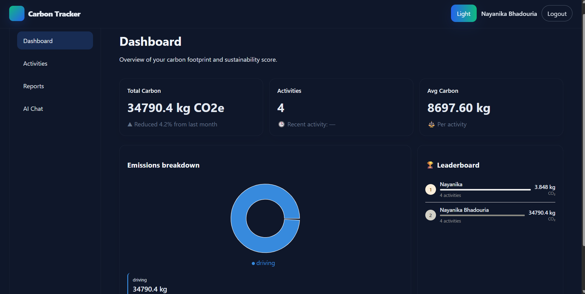

<div align="center">

# Carbon Tracker

### Track • Analyze • Reduce Your Carbon Footprint

A modern web application that helps users monitor their carbon emissions, visualize environmental impact, and generate insightful reports for a sustainable lifestyle.


</div>

---

# About

Carbon Tracker is a full-stack web application designed to help users understand and reduce their carbon footprint.

The application enables users to track daily activities, calculate carbon emissions, analyze trends using interactive charts, and generate downloadable reports. Its intuitive interface encourages environmentally responsible decision-making.

---

# Features

✅ Carbon Footprint Tracking

✅ Interactive Dashboard

✅ Circular Charts & Graphs

✅ Downloadable Reports (PDF)

✅ Dark / Light Theme

✅ Responsive UI

✅ User Authentication

✅ Real-time Data Analysis

---

# Project view

## Dashboard

<p align="center">

</p>

---

# Tech Stack

| Frontend | Backend | Database | Tools |
|-----------|----------|----------|------|
| HTML5 | Node.js | MongoDB | Git |
| CSS3 | Express.js | Mongoose | GitHub |
| JavaScript | REST API | | VS Code |

---

# Folder Structure

```
carbon-tracker/
│
├── client/
│   ├── assets/
│   ├── css/
│   ├── js/
│   └── pages/
│
├── server/
│   ├── routes/
│   ├── models/
│   ├── controllers/
│   └── config/
│
├── README.md
├── package.json
└── .gitignore
```


#  Installation

Clone the repository

```bash
git clone https://github.com/Nayanika-3103/carbon-tracker.git
```

Go to project directory

```bash
cd carbon-tracker
```

Install dependencies

```bash
npm install
```

Run the server

```bash
npm start
```

---

#  Future Enhancements

- AI-powered Carbon Reduction Suggestions
- Weekly Sustainability Reports
- Google Maps Integration
- Carbon Offset Calculator
- Community Challenges
- Mobile Application

---

#  Project Objectives

- Encourage sustainable living.
- Help users understand their environmental impact.
- Provide data visualization for better decision-making.
- Generate detailed environmental reports.

---

#  Key Highlights

✔ Responsive Design

✔ Modern User Interface

✔ Interactive Charts

✔ Report Generation

✔ Theme Switching

✔ Secure Authentication

✔ Scalable Architecture

---
DEMO LINK: https://golden-parfait-471dbf.netlify.app

#  Contributing

Contributions are welcome!

If you'd like to improve this project:

1. Fork the repository
2. Create a new branch
3. Commit your changes
4. Push the branch
5. Create a Pull Request

---

#  Developer

**Nayanika Bhadouria**

B.Tech CSE Student | AI Enthusiast | Full Stack Developer

GitHub: https://github.com/Nayanika-3103

LinkedIn: https://www.linkedin.com/in/nayanika-bhadouria-57b7a13a1/

---

<div align="center">

###  If you like this project, don't forget to Star the repository!

Made with for a Greener Planet 🌍

</div>
